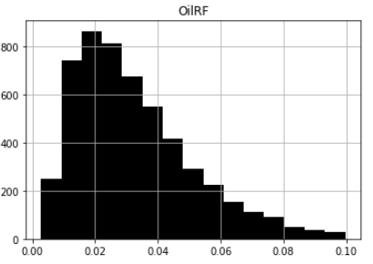
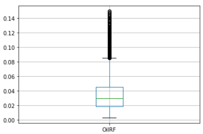
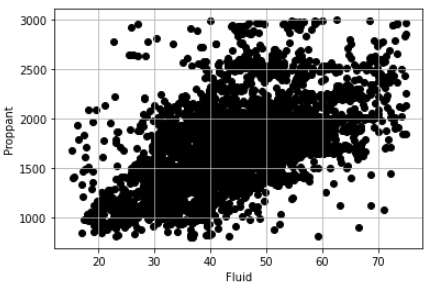
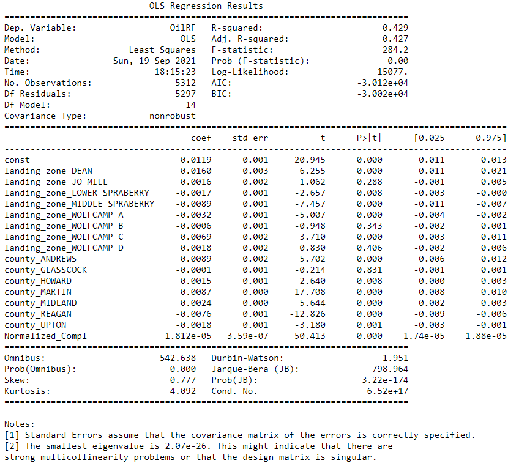
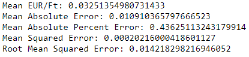
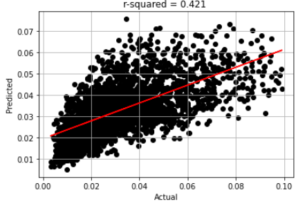

# Friday_Night_Lights

## Contents
- [Project Objective](#objective)
- [Files](#files)
- [Team Protocols](#team-communication-protocols)
- [Overview of the Project](#overview)
- [Dataset](#dataset)
- [Machine Learning Model](#machine-learning-model)
- [K-Means Clustering](#k-means)

## Objective
Use machine learning to determine key factors for successfully producing wells in the Permian Basin via a quantitative & statistical analysis of producing horzitonal wells.

## Files
### Python Code
- MB_WellDistCalc.ipynb - Python code for calculating well spacing from lat-long data
- Permian_ML_Model_OHE_NL_RF_Corr - Python code that contains the final machine learning models
- Permian_KMeans_RockType - Python code that uses K-means algorithm for determining rock type from geologic inputs
- Permian_ML_Model_Incorporating_RockType - Python code that incorporates rock type calulcted from K-means into the machine learning model

### Input Data
- Resources\FNL_DataSet_For_Import.csv - File with most of the data inputs
- Resources\Well Distance_Recalc.csv - Calculated well spacing output
- Resources\FNL_Well Data Schema.sql - Schema for main SQL database creation
- Resources\FNL_Distance Data Schema.sql - Schema for distance table creation
- Resources\Join_Update_Query.sql - Query to join main data table and distance table

Other miscellaneous queries for table creation and join are also present in the Resouces folder

## Team Communication Protocols

The project was the result of work from four team members who worked remotely.  The team utilized Google Meet and Slack for communication and any scripts or files are delivered through this GitHub repository.

## Overview

For decades, scientists and engineers have studied  complex geology, reservoir properties and various production strategies to identify factors most associated with successful reservoir production.  This study is designed to evaluate a large dataset of reservoir properties along with historical well production data to build a machine-learning model that can be used to determine optimal number of wells and completion (or "frac") design for successful long-term production. Production is determined by gross EUR (Expected Ultimate Recovery) which is a forecast of the maximum recoverable production over the life of the well. 
 
## Dataset

Data for the project is sourced from IHS Enerdeq which includes:
(1) Header data: several well identifiers and location information for the wells
(2) Independent input variables: well length (also called lateral length), proppant and fluid volume (frac design), well spacing (distance between wells), geologic parameters like porosity and oil saturation that determine the amount of oil present initially (original oil in place)
(3) Dependent variable - Oil EUR (forecasted from historical oil production data) per volume of oil present in the rock (also known as oil recovery factor)

Well spacing was calculated using lat-long data with a separate Python code developed for this purpose.

All static data is stored using PostgreSQL where tables are imported from CSV files and joined into a primary table with all well data using the unique well id.

## Machine Learning Model
### Model Overview
The independent variable list is made up of several continuous numeric variables and at least two categorcial variables. The dependent variable (EUR) is a continuous variable. Based on an assessment of the dataset, the team chose to start with a multiple linear regression (MLR) model. The goal of MLR is to model the linear relationship between the independent variables and one or more dependent response variables. 

### Data Cleaning
The team followed a structured data preprocessing effort to eliminate unwanted variables (ID, names etc.) and also remove rows that did not contain key input variables or the response variable. Also, the team employed min and max cutoffs on both input and response variables based on professional experience and proficiency with the subject. A histogram and box plot of the response variable shows a small population of outliers that were eventually eliminated. While this resulted in several rows being eliminated, the final dataset contained over 6000 rows of fully populated data. 

### Variable Selection
Step 1: The team started by cross-plotting each of the independent variables against the response variable to observe any discernible correlation. However, the complex nature of oilfield geology and the presence of multiple explanatory variables resulted in little to no observable corerlation between variables.
Step 2: The next step was to cross-plot independent variables against each other to ensure there are no multi-collinearity issues. Some variables were eliminated this way. For example, frac fluid volume and proppant volume were strongly correlated and hence proppant was excluded from the list (see image below).

Step 3: Encoding of categorical variables (see secion on encoding below)
Step 4: The next step was to generate statistics and p-values on the independent variables to determine statistically significant variables and check for potential collinearity issues. The results of an ordinary least squares (OLS) model are shown below.

It can be seen that the p-values of most variables are less than 0.05, indicating that they are statistically significant. Some variables with high p-values were omitted in the final model. A statement in the footnote suggests multicollinearity issues based on the smallest eigen value. However, the  team was unable to determine the variables that could be the cause of this issue.
Step 5: The next step was to create train and test datasets and run the regression model. The results  of the model are shown below.

The mean percentage error in the model is 43%, suggesting a poor quality dataset or presence of other independent variables that have not been accountd for. The latter is a more plausible explanation, as several geologic parameters were not available to the team from the public realm. Plot below shows an r^2 of 0.42 for values predicted by the model compared to the actual.

### Categorical Variable Treatment
The team pursued various alternatives to encode the two categorical variables present - Landing Zone (which indicates the subsurface vertical location where the well is drilled) and County (which segregates the wells geographically). After working with a few label encoded variations, the team chose to "one-hot" encode the categorical variables.

### Other Regression Models
A few other linear and non-linear models like Gradient Boosting and Random Forest regression were attempted in an effort to improve the data. However, the results from the original model were found to give similar results as compared the other models trialed.

### Dashboard
Using Tableau public, we were able to visualize the chaotic and disorganized data set. When grouped by either EUR or landing zone , no discernable trend can be established at the state or even county view. From our histogram, we have a left skewed distribuiton just from Eur value, with correlates to industy standards/probability.

[Friday Night Ligts Dashboard](https://public.tableau.com/app/profile/david.mcadoo/viz/Group9FridayNightLightsDashboard/Dashboard2?publish=yes)
